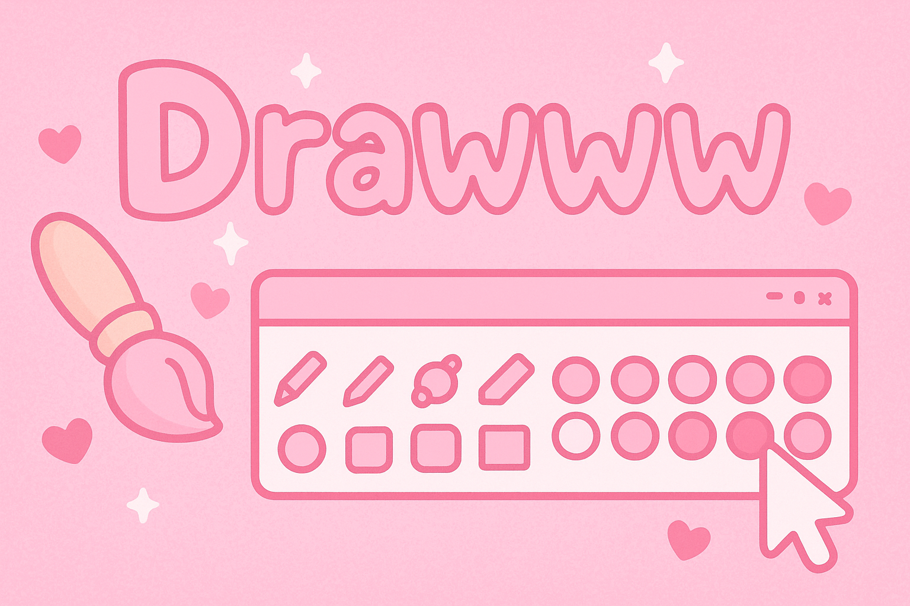
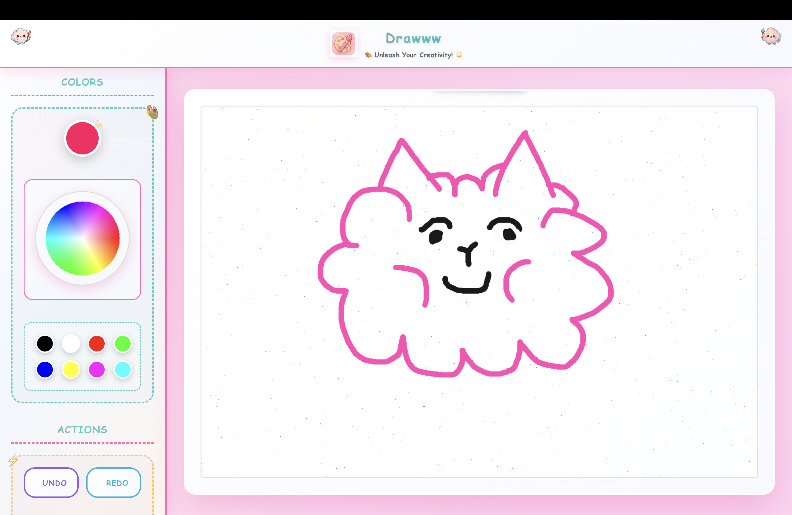

<!-- Banner -->
<p align="center">
  
</p>

<h1 align="center">🎨 Drawww – Web-Based Paint App with Vibes</h1>

<p align="center">
  <b>A modern, full-featured drawing app wrapped in ✨vibes✨ and pastel dreams</b><br/>
  <a href="https://drawww-seven.vercel.app" target="_blank">🖼️ Live Demo</a> • 
  <a href="https://github.com/yusufchipa/Drawww-Web-Based-Paint-App.git" target="_blank">💻 Source Code</a>
</p>

---

## ✨ Overview

**Drawww** is a cute-yet-powerful modern paint application built with React, Vite, and the HTML5 Canvas API.  
It combines *pro-grade drawing tools* with an aesthetic UI full of rainbow gradients, glassmorphism, emojis, and vibes.  
Think MS Paint but ✨ Gen Z coded ✨.

---

## 🔧 Features

### 🖌️ Drawing Tools
| Tool     | Details |
|----------|---------|
| ✏️ Pencil | Ultra-precise (40% brush size) |
| 🖌️ Brush | Smooth medium strokes (120% size, 90% opacity) |
| 🖍️ Marker | Highlighter effect (250% size, 25% opacity) |
| 🧽 Eraser | Exact canvas-match white (130% size) |
| 🪣 Fill Tool | Flood fill for enclosed areas |
| 🔤 Text Tool | Click-to-place, dynamically sized |

### 🎨 Color System
- Interactive HSV color wheel 🌈
- 8 quick-select preset swatches
- Live color preview with hover animations
- Pixel-perfect white matching for tools

### 📏 Brush Controls
- Adjustable size (1–50px) with slider + buttons
- Live brush preview that updates per tool
- Each tool has its own visual style

### ⏪ History System
- 50-step undo/redo system with real-time state tracking
- Smart memory handling for long sessions
- Button feedback based on action availability

### 💾 Export & Canvas Management
- Export high-res PNG with proper background
- Instant clear/reset with consistent fill
- Mobile/touch support included
- Fully responsive design

---

## 🌈 UI/UX Magic

- 🌠 Animated pastel gradient backgrounds
- 🎭 Comic Sans (YES, unironically) with rainbow headers
- 🧊 Glassmorphism: blur, transparency, and vibes
- ☁️ Floating clouds & bouncing emoji accents
- ✨ Sparkles, pulsing previews, shimmer buttons, and hover animations
- 🖼️ Custom wiggling title: *"Your Masterpiece!"*

---

## 🛠️ Tech Stack

| Layer | Tech |
|-------|------|
| 💻 Frontend | React 18 + Vite + JavaScript (ES6+) |
| 🎨 Styling | CSS3 (Flex, Grid, Media Queries, Animations) |
| 🖼️ Canvas | HTML5 Canvas API + 2D Context + Pixel Ops |
| 🧠 Logic | Flood Fill, HSV Calculations, History Buffer |
| 🧩 Libraries | `lucide-react`, `react-color-palette`, React Hooks |
| 📦 Patterns | Component Composition, Forward Refs, Custom Hooks |

---

## 🧠 Architecture & Performance

- Modular component architecture
- Lazy-loaded logic and optimizations for speed
- GPU-accelerated CSS animations
- Memory-optimized state handling
- Touch support for mobile & tablet drawing

---

## 📸 Preview

<p align="center">
  
  <br/>
  <em>Yeah... it really do look that cute</em>
</p>

---

## 🚀 Live Demo

👉 [Try Drawww Live on Vercel](https://drawww-seven.vercel.app)

---

## 🤝 Contribute

Wanna make it even MORE chaotic and cute?  
Feel free to fork it, star it, or PR it — let’s make the web colorful AF 🌈💅

```bash
git clone https://github.com/yusufchipa/Drawww-Web-Based-Paint-App.git
cd Drawww-Web-Based-Paint-App
npm install
npm run dev
```
