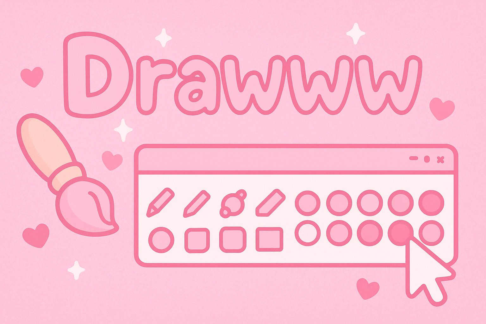
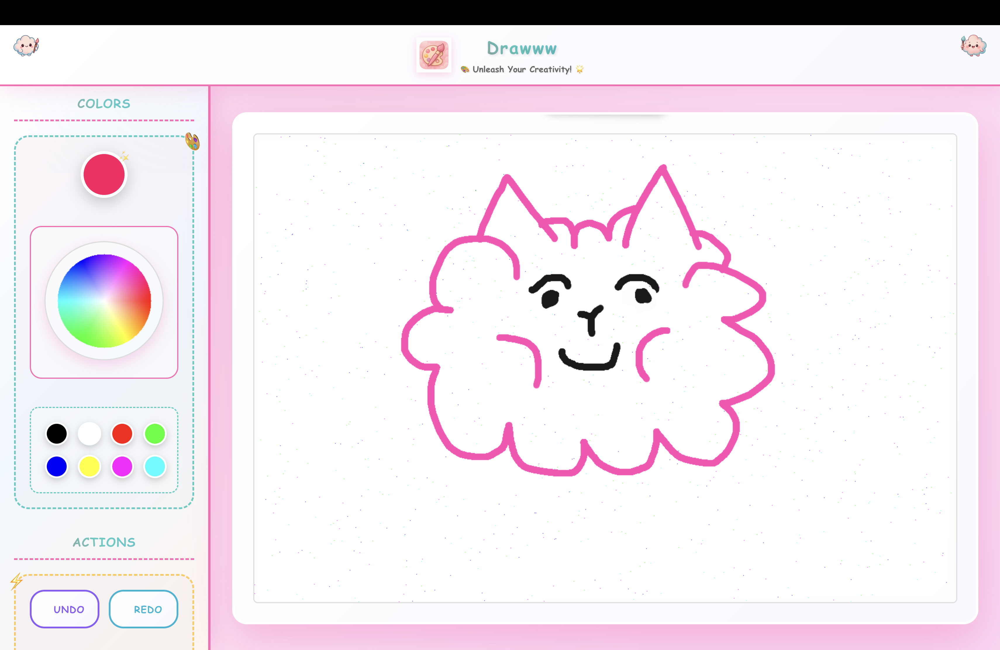

<!-- Banner -->

<p align="center">
  
</p>

<h1 align="center">🎨 Drawww</h1>

<p align="center">
  <strong>A modern web-based paint app packed with creative tools, playful visuals, and immaculate vibes ✨</strong>
</p>

<p align="center">
  <a href="https://drawww-seven.vercel.app">
    
  </a>
  <a href="https://github.com/yusufchipa/Drawww-Web-Based-Paint-App">
    
  </a>
</p>

<p align="center">
  React • Vite • HTML5 Canvas • Modern UI • Mobile Friendly
</p>

---

## ✨ About

**Drawww** is a feature-rich browser drawing application built using **React**, **Vite**, and the **HTML5 Canvas API**.

It combines powerful drawing functionality with a fun, colorful interface inspired by modern design trends like glassmorphism, gradients, micro-animations, and playful visuals.

Think of it as:

> 🎨 MS Paint + ✨ modern web magic + 🌈 Gen Z aesthetics

---

## 📸 Preview

<p align="center">
  
</p>

<p align="center">
  <em>Create sketches, doodles, notes, artwork, and pure chaos.</em>
</p>

---

## 🚀 Live Demo

### 🌐 Try it now

**👉 https://drawww-seven.vercel.app**

No downloads. No setup.

Just open and start drawing.

---

## 🖌️ Drawing Features

### ✏️ Pencil

Precise, lightweight strokes for detailed sketching.

### 🖌️ Brush

Smooth natural drawing with balanced opacity.

### 🖍️ Marker

Semi-transparent highlighter effect for layering.

### 🧽 Eraser

Clean canvas matching with accurate color replacement.

### 🪣 Fill Tool

Flood-fill enclosed regions instantly.

### 🔤 Text Tool

Place editable text directly onto the canvas.

---

## 🎨 Color System

* 🌈 Interactive HSV Color Picker
* 🎯 Accurate color selection
* 🎨 Quick-access color swatches
* 👀 Live color preview
* ✨ Smooth hover animations

---

## 📏 Brush Controls

* Adjustable size from **1–50px**
* Real-time brush preview
* Tool-specific brush behavior
* Slider + increment controls
* Consistent drawing experience

---

## ⏪ Undo / Redo History

Drawww includes a robust drawing history system:

* 🔄 50-step history buffer
* ↩️ Undo support
* ↪️ Redo support
* ⚡ Instant state restoration
* 🧠 Optimized memory handling

---

## 💾 Canvas Management

### Export

* High-quality PNG export
* Preserves artwork quality
* Clean background rendering

### Reset

* One-click canvas clearing
* Consistent reset behavior

### Mobile Support

* Touch-friendly interactions
* Responsive controls
* Tablet-compatible drawing

---

## 🌈 UI Experience

Drawww isn't just functional—it has personality.

### Included Goodies

* 🌠 Animated pastel backgrounds
* 🧊 Glassmorphism panels
* ☁️ Floating cloud decorations
* ✨ Sparkle effects
* 🎭 Comic Sans energy
* 🌈 Rainbow gradients
* 😊 Emoji accents
* 🎯 Interactive hover effects
* 💫 Shimmer animations
* 🖼️ Wiggling masterpiece title

---

## 🛠️ Tech Stack

| Category         | Technology          |
| ---------------- | ------------------- |
| Frontend         | React 18            |
| Build Tool       | Vite                |
| Language         | JavaScript (ES6+)   |
| Drawing Engine   | HTML5 Canvas API    |
| Styling          | CSS3                |
| Icons            | lucide-react        |
| Color Picker     | react-color-palette |
| State Management | React Hooks         |

---

## 🧠 Under The Hood

### Canvas Logic

* Pixel-level operations
* Flood fill algorithm
* Dynamic brush rendering
* Touch event handling

### Performance

* Optimized rendering pipeline
* GPU-accelerated animations
* Efficient history management
* Modular component architecture

### Design

* Responsive layouts
* Mobile-first support
* Reusable components
* Clean project structure

---

## 📂 Project Structure

```bash
src/
├── components/
├── hooks/
├── utils/
├── styles/
├── App.jsx
└── main.jsx
```

---

## ⚡ Getting Started

### Clone Repository

```bash
git clone https://github.com/yusufchipa/Drawww-Web-Based-Paint-App.git
```

### Install Dependencies

```bash
npm install
```

### Start Development Server

```bash
npm run dev
```

### Build Production Version

```bash
npm run build
```

---

## 🗺️ Roadmap

Future ideas for Drawww:

* [ ] Layers
* [ ] Shape tools
* [ ] Custom brushes
* [ ] SVG export
* [ ] Dark mode
* [ ] Selection tool
* [ ] Canvas zoom
* [ ] Collaboration mode

---

## 🤝 Contributing

Contributions are welcome.

If you have ideas, improvements, bug fixes, or new features:

1. Fork the repository
2. Create a feature branch
3. Commit your changes
4. Open a Pull Request

---

## ⭐ Support

If you enjoyed this project:

🌟 Star the repository
🍴 Fork it
🎨 Create something awesome

---

<p align="center">
  Made with ☕, React, Canvas API, and questionable amounts of rainbow gradients 🌈
</p>
